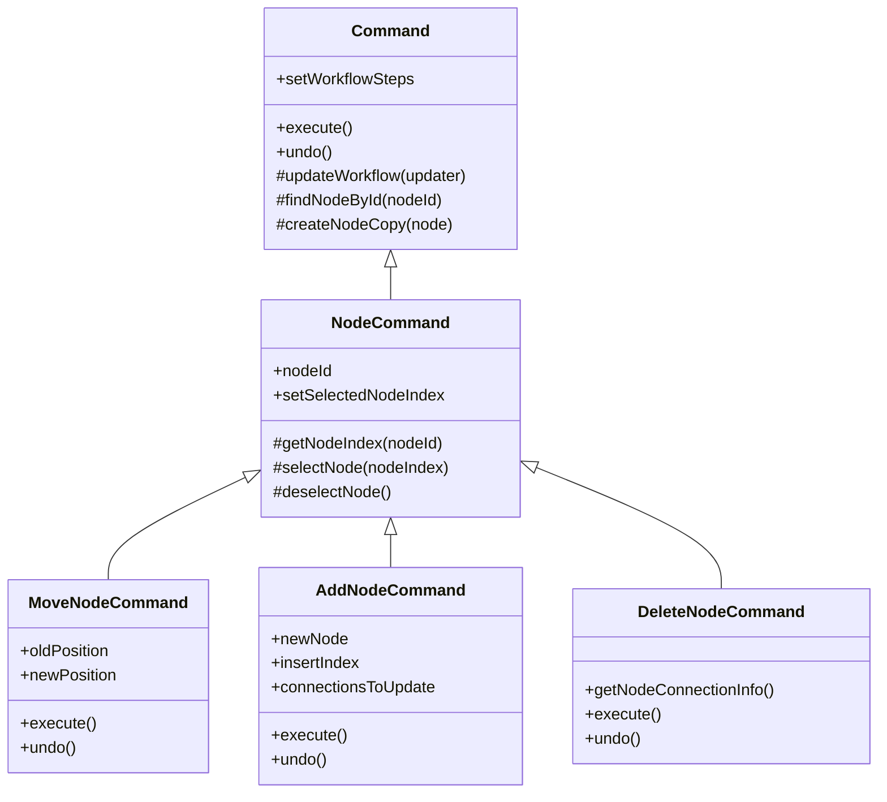
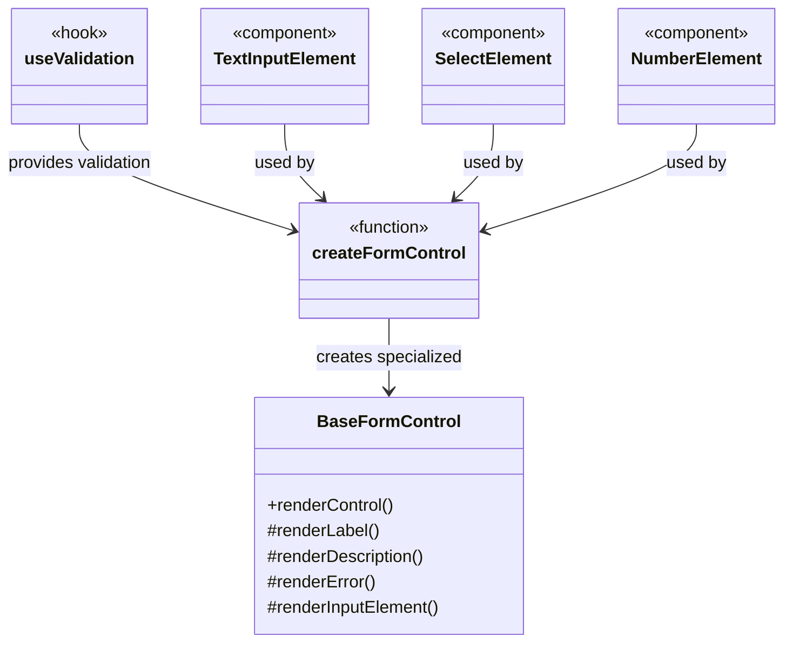
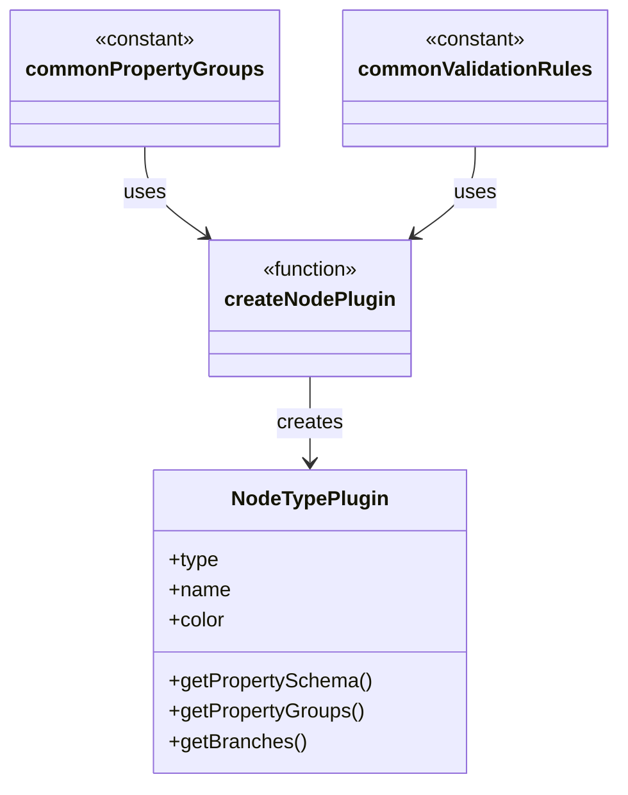
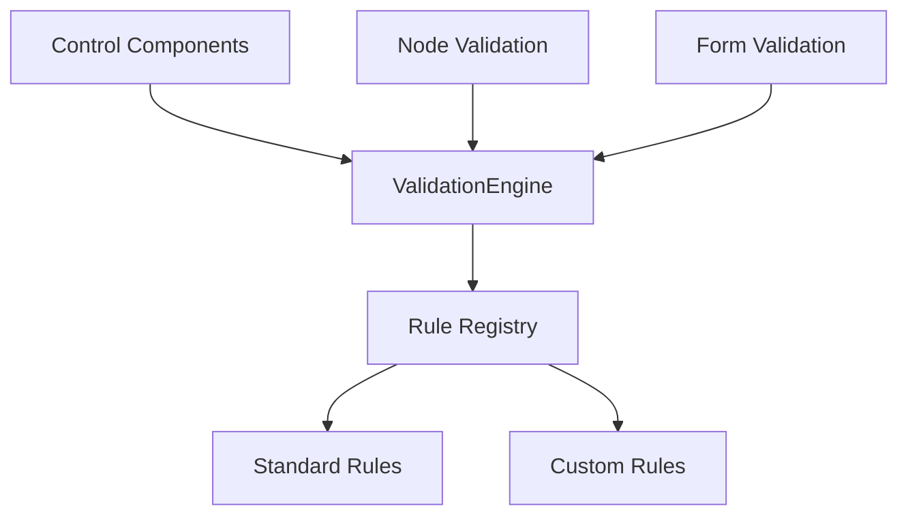
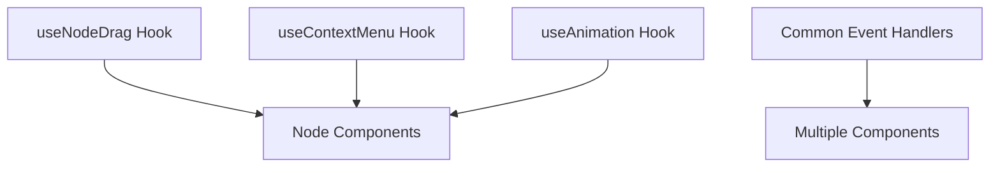

# Automation Workflow Refactoring Plan

## Table of Contents
1. [Introduction](#introduction)
2. [Identified Areas of Code Duplication](#identified-areas-of-code-duplication)
3. [Command Pattern Refactoring](#command-pattern-refactoring)
4. [UI Controls Refactoring](#ui-controls-refactoring)
5. [Node Plugin Refactoring](#node-plugin-refactoring)
6. [Validation Framework Refactoring](#validation-framework-refactoring)
7. [Event Handling Refactoring](#event-handling-refactoring)
8. [Implementation Approach](#implementation-approach)
9. [Expected Benefits](#expected-benefits)

## Introduction

This document outlines a comprehensive plan to refactor the Automation Workflow codebase to address pervasive code duplication and enhance maintainability. The current codebase exhibits repetitive patterns across multiple areas, making it difficult to maintain and extend. This refactoring plan proposes targeted solutions to reduce duplication, increase code reuse, and improve the overall architecture.

## Identified Areas of Code Duplication

After thorough analysis, we've identified several key areas with significant code duplication:

### 1. Command Pattern Implementation

The command classes (`AddNodeCommand`, `DeleteNodeCommand`, `MoveNodeCommand`) contain repetitive code:

- Similar constructor patterns that store almost identical state and React setters
- Repetitive use of `this.setWorkflowSteps(currentSteps => {...})` pattern
- Duplicated patterns for creating copies of state arrays
- Similar undo/execute implementations with only slight variations

### 2. UI Controls

The property controls (`TextInputControl`, `SelectControl`, `NumberControl`) have nearly identical:

- Component structure and wrapper divs
- Label and error handling
- Validation logic with similar patterns
- CSS class application

### 3. Node Type Plugins

The plugin implementations show duplication in:

- Configuration patterns
- Property group definitions
- Validation rule structures
- Branch handling

### 4. Validation Logic

Redundant validation implementations across:
- Property controls
- ValidationEngine
- Inline validation in components

### 5. Component Event Handling

Repetitive event handling patterns:
- Similar mouseDown/mouseMove/mouseUp handlers
- Duplicated animation logic
- Repeated state management

## Command Pattern Refactoring

### Current Issues

The existing command implementation shows several areas of duplication:

1. Each command separately implements similar workflow state management.
2. Common operations like finding nodes by ID are reimplemented.
3. `setWorkflowSteps` with functional updates is duplicated across commands.
4. State cloning and manipulation follows similar patterns.

### Proposed Solution

Create a more robust base Command class with shared functionality:



### Implementation Details

1. Enhance the base `Command` class:

```javascript
export class Command {
  /**
   * Execute the command and return the result
   * @returns {any} The result of executing the command
   */
  execute() {
    throw new Error('Method execute() must be implemented by derived classes');
  }

  /**
   * Undo the command and return to the previous state
   * @returns {any} The result of undoing the command
   */
  undo() {
    throw new Error('Method undo() must be implemented by derived classes');
  }

  /**
   * Helper method for updating workflow with functional update pattern
   * @param {Function} updater - Function to update workflow steps
   * @returns {Array} Updated workflow steps
   */
  _updateWorkflow(updater) {
    let result;
    this.setWorkflowSteps(currentSteps => {
      result = updater(currentSteps);
      return result;
    });
    return result;
  }

  /**
   * Find a node in the workflow by ID
   * @param {Array} steps - The workflow steps array
   * @param {string} nodeId - The ID of the node to find
   * @returns {Object} The found node and its index, or null if not found
   */
  _findNodeById(steps, nodeId) {
    const index = steps.findIndex(step => step.id === nodeId);
    if (index === -1) return { node: null, index: -1 };
    return { node: steps[index], index };
  }
}
```

2. Create an intermediate `NodeCommand` class:

```javascript
export class NodeCommand extends Command {
  constructor(setWorkflowSteps, setSelectedNodeIndex, nodeId) {
    super();
    this.setWorkflowSteps = setWorkflowSteps;
    this.setSelectedNodeIndex = setSelectedNodeIndex;
    this.nodeId = nodeId;
  }
  
  /**
   * Get the index of a node in the workflow
   * @param {Array} steps - The workflow steps array
   * @returns {number} The index of the node
   */
  _getNodeIndex(steps) {
    return steps.findIndex(step => step.id === this.nodeId);
  }
  
  /**
   * Select a node by its index
   * @param {number} index - The index of the node to select
   */
  _selectNode(index) {
    if (this.setSelectedNodeIndex) {
      this.setSelectedNodeIndex(index);
    }
  }
  
  /**
   * Deselect the currently selected node
   */
  _deselectNode() {
    if (this.setSelectedNodeIndex) {
      this.setSelectedNodeIndex(null);
    }
  }
}
```

3. Refactor the specific command classes to leverage the base functionality.

## UI Controls Refactoring

### Current Issues

The UI controls in the codebase exhibit significant duplication:

1. Each control (`TextInputControl`, `SelectControl`, `NumberControl`) repeats nearly identical component structure.
2. Common patterns like label rendering, error display, and description text are duplicated.
3. Validation logic follows similar patterns but is implemented separately.
4. CSS classes and styling patterns are repeated.

### Proposed Solution

Create a component-based architecture that emphasizes composition and reuse for UI controls. We'll implement this using:

1. A base component for shared structure
2. Composition patterns for specialized behavior
3. Hook-based validation logic 
4. Centralized styling



### Detailed Implementation

#### 1. Create a Base Form Control Component

First, create a reusable base component for form controls:

```jsx
// src/components/AutomationWorkflow/controls/BaseFormControl.jsx
import React from 'react';
import PropTypes from 'prop-types';

const BaseFormControl = ({
  id,
  label,
  description,
  error,
  renderInput,
  className = '',
  ...rest
}) => {
  return (
    <div className={`form-control mb-4 ${className}`}>
      {label && (
        <label 
          htmlFor={id} 
          className="block text-sm font-medium text-gray-700 mb-1"
        >
          {label}
        </label>
      )}
      
      {description && (
        <p className="text-sm text-gray-500 mb-2">{description}</p>
      )}
      
      {renderInput && renderInput(rest)}
      
      {error && (
        <p className="mt-1 text-sm text-red-500">{error}</p>
      )}
    </div>
  );
};

BaseFormControl.propTypes = {
  id: PropTypes.string,
  label: PropTypes.string,
  description: PropTypes.string,
  error: PropTypes.string,
  renderInput: PropTypes.func.isRequired,
  className: PropTypes.string
};

export default BaseFormControl;
```

#### 2. Create a Form Control Factory Function

Next, implement a factory function to create specialized controls:

```jsx
// src/components/AutomationWorkflow/controls/createFormControl.js
import React from 'react';
import BaseFormControl from './BaseFormControl';
import { PropertyControl } from './PropertyControl';

/**
 * Factory function to create a form control
 * @param {Object} config - Configuration object
 * @returns {PropertyControl} A PropertyControl instance
 */
export const createFormControl = (config) => {
  const {
    type,
    renderInput,
    validate,
    defaultProps = {}
  } = config;
  
  // Create the component using BaseFormControl
  const component = (props) => {
    const {
      value,
      onChange,
      label,
      error,
      description,
      controlProps = {},
      ...rest
    } = props;
    
    // Merge default props with passed props
    const mergedProps = {
      ...defaultProps,
      ...rest,
      ...controlProps
    };
    
    // Create a unique ID for the input if not provided
    const id = rest.id || `${type}-control-${Math.random().toString(36).substr(2, 9)}`;
    
    return (
      <BaseFormControl
        id={id}
        label={label}
        description={description}
        error={error}
        renderInput={(inputProps) => renderInput({
          id,
          value,
          onChange,
          error,
          ...mergedProps,
          ...inputProps
        })}
      />
    );
  };
  
  // Return a PropertyControl instance
  return new PropertyControl({
    type,
    component,
    validate,
    defaultProps
  });
};
```

#### 3. Create Specialized Input Elements

Create individual input elements that can be composed with the BaseFormControl:

```jsx
// src/components/AutomationWorkflow/controls/elements/TextInputElement.jsx
import React from 'react';

const TextInputElement = ({ id, value, onChange, error, ...props }) => (
  <input
    id={id}
    type="text"
    value={value || ''}
    className={`w-full p-2 border ${error ? 'border-red-500' : 'border-gray-300'} rounded-md`}
    onChange={(e) => onChange(e.target.value)}
    {...props}
  />
);

export default TextInputElement;
```

```jsx
// src/components/AutomationWorkflow/controls/elements/SelectElement.jsx
import React from 'react';

const SelectElement = ({ id, value, onChange, error, options = [], ...props }) => (
  <select
    id={id}
    value={value || ''}
    className={`w-full p-2 border ${error ? 'border-red-500' : 'border-gray-300'} rounded-md`}
    onChange={(e) => onChange(e.target.value)}
    {...props}
  >
    <option value="">Select an option</option>
    {options.map(option => (
      <option key={option.value} value={option.value}>
        {option.label}
      </option>
    ))}
  </select>
);

export default SelectElement;
```

```jsx
// src/components/AutomationWorkflow/controls/elements/NumberElement.jsx
import React from 'react';

const NumberElement = ({ id, value, onChange, error, ...props }) => (
  <input
    id={id}
    type="number"
    value={value !== undefined ? value : ''}
    className={`w-full p-2 border ${error ? 'border-red-500' : 'border-gray-300'} rounded-md`}
    onChange={(e) => onChange(e.target.value === '' ? undefined : Number(e.target.value))}
    {...props}
  />
);

export default NumberElement;
```

#### 4. Create a Validation Hook

Extract common validation logic to a reusable hook:

```jsx
// src/components/AutomationWorkflow/controls/hooks/useValidation.js
import { useState, useCallback } from 'react';

/**
 * Custom hook for form field validation
 * @param {Function} validationFn - Validation function
 * @param {Object} rules - Validation rules
 * @returns {Object} Validation state and functions
 */
export const useValidation = (validationFn, rules) => {
  const [error, setError] = useState(null);
  
  const validate = useCallback((value) => {
    const validationError = validationFn(value, rules);
    setError(validationError);
    return !validationError;
  }, [validationFn, rules]);
  
  const clearError = useCallback(() => {
    setError(null);
  }, []);
  
  return {
    error,
    validate,
    clearError,
    isValid: !error
  };
};
```

#### 5. Implement the Refactored Controls

Now, reimplement the existing controls using our new architecture:

```jsx
// src/components/AutomationWorkflow/controls/TextInputControl.js
import { createFormControl } from './createFormControl';
import TextInputElement from './elements/TextInputElement';

/**
 * Text Input Control
 *
 * A control for text input properties.
 */
export const TextInputControl = createFormControl({
  type: 'text',
  renderInput: (props) => <TextInputElement {...props} />,
  validate: (value, rules) => {
    if (rules.required && (!value || value.trim() === '')) {
      return 'This field is required';
    }
    if (rules.minLength && value.length < rules.minLength) {
      return `Must be at least ${rules.minLength} characters`;
    }
    if (rules.maxLength && value.length > rules.maxLength) {
      return `Must be no more than ${rules.maxLength} characters`;
    }
    if (rules.pattern && !new RegExp(rules.pattern).test(value)) {
      return rules.patternMessage || 'Invalid format';
    }
    return null;
  }
});
```

```jsx
// src/components/AutomationWorkflow/controls/SelectControl.js
import { createFormControl } from './createFormControl';
import SelectElement from './elements/SelectElement';

/**
 * Select Control
 *
 * A control for select/dropdown properties.
 */
export const SelectControl = createFormControl({
  type: 'select',
  renderInput: (props) => <SelectElement {...props} />,
  validate: (value, rules) => {
    if (rules.required && (!value || value === '')) {
      return 'This field is required';
    }
    return null;
  }
});
```

```jsx
// src/components/AutomationWorkflow/controls/NumberControl.js
import { createFormControl } from './createFormControl';
import NumberElement from './elements/NumberElement';

/**
 * Number Control
 *
 * A control for numeric input properties.
 */
export const NumberControl = createFormControl({
  type: 'number',
  renderInput: (props) => <NumberElement {...props} />,
  validate: (value, rules) => {
    if (rules.required && (value === undefined || value === null || value === '')) {
      return 'This field is required';
    }
    if (rules.min !== undefined && value < rules.min) {
      return `Must be at least ${rules.min}`;
    }
    if (rules.max !== undefined && value > rules.max) {
      return `Must be no more than ${rules.max}`;
    }
    return null;
  }
});
```

#### 6. Creating New Controls Is Now Simple

Adding a new control type becomes straightforward:

```jsx
// src/components/AutomationWorkflow/controls/CheckboxControl.js
import React from 'react';
import { createFormControl } from './createFormControl';

const CheckboxElement = ({ id, value, onChange, label, ...props }) => (
  <div className="flex items-center">
    <input
      id={id}
      type="checkbox"
      checked={!!value}
      className="h-4 w-4 text-blue-600 focus:ring-blue-500 border-gray-300 rounded"
      onChange={(e) => onChange(e.target.checked)}
      {...props}
    />
    <label htmlFor={id} className="ml-2 block text-sm text-gray-900">
      {label}
    </label>
  </div>
);

export const CheckboxControl = createFormControl({
  type: 'checkbox',
  renderInput: (props) => <CheckboxElement {...props} />,
  validate: (value, rules) => {
    if (rules.required && !value) {
      return 'This field is required';
    }
    return null;
  }
});
```

### Benefits of this Approach

This refactored UI Controls architecture offers several key benefits:

1. **Reduced Duplication**: Common UI structure and behavior are defined once.
2. **Improved Flexibility**: Easy to add new control types without duplicating code.
3. **Better Separation of Concerns**: Clear separation between display logic and data handling.
4. **Enhanced Testability**: Smaller, more focused components are easier to test.
5. **Centralized Validation**: Validation logic is standardized and reusable.
6. **Consistent Styling**: UI appearance remains consistent across all controls.

## Node Plugin Refactoring

### Current Issues

The node plugin implementations contain repeated code in several areas:

1. Configuration object structure with similar properties
2. Property group definitions with repeated patterns
3. Validation rules with similar structures
4. Common initialization code

### Proposed Solution

Create factory functions and shared configurations to eliminate duplication:



### Implementation Details

1. Extract common property groups:

```javascript
// src/components/AutomationWorkflow/plugins/common/propertyGroups.js
export const commonPropertyGroups = {
  // Basic information group used in most node types
  basic: {
    id: 'basic',
    label: 'Basic Information',
    description: 'Configure the basic information',
    collapsed: false,
    order: 0
  },
  
  // Advanced settings group
  advanced: {
    id: 'advanced',
    label: 'Advanced Settings',
    description: 'Configure advanced options',
    collapsed: true,
    order: 10
  }
};
```

2. Extract common property definitions:

```javascript
// src/components/AutomationWorkflow/plugins/common/propertyDefinitions.js
export const commonProperties = {
  // Title property used in all node types
  title: {
    id: 'title',
    type: 'text',
    label: 'Title',
    description: 'The name of this node',
    required: true,
    groupId: 'basic',
    order: 0
  },
  
  // Subtitle property used in most node types
  subtitle: {
    id: 'subtitle',
    type: 'text',
    label: 'Subtitle',
    description: 'A brief description',
    required: false,
    groupId: 'basic',
    order: 1
  }
};
```

3. Extract common validation rules:

```javascript
// src/components/AutomationWorkflow/plugins/common/validationRules.js
export const commonValidationRules = {
  title: {
    required: true,
    minLength: 3,
    maxLength: 50
  },
  subtitle: {
    maxLength: 100
  }
};
```

4. Create a plugin factory function:

```javascript
// src/components/AutomationWorkflow/plugins/createNodePlugin.js
import { NodeTypePlugin } from './NodeTypePlugin';
import { commonPropertyGroups } from './common/propertyGroups';
import { commonProperties } from './common/propertyDefinitions';
import { commonValidationRules } from './common/validationRules';

/**
 * Factory function to create a node plugin with common functionality
 * @param {Object} config - Plugin configuration
 * @returns {NodeTypePlugin} A configured NodeTypePlugin instance
 */
export function createNodePlugin(config) {
  // Merge common property groups with custom ones
  const propertyGroups = [
    ...(config.useCommonGroups || []).map(groupId => commonPropertyGroups[groupId]),
    ...(config.propertyGroups || [])
  ];
  
  // Merge common properties with custom ones
  const propertySchema = [
    ...(config.useCommonProperties || []).map(propId => commonProperties[propId]),
    ...(config.propertySchema || [])
  ];
  
  // Merge common validation rules with custom ones
  const validationRules = {
    ...(config.useCommonProperties || []).reduce((rules, propId) => {
      if (commonValidationRules[propId]) {
        rules[propId] = commonValidationRules[propId];
      }
      return rules;
    }, {}),
    ...(config.validationRules || {})
  };
  
  // Create the plugin with merged configuration
  return new NodeTypePlugin({
    ...config,
    propertyGroups,
    propertySchema,
    validationRules
  });
}
```

5. Refactor existing plugins to use the factory:

```javascript
// src/components/AutomationWorkflow/plugins/IfElseNodePlugin.js
import { createNodePlugin } from './createNodePlugin';
import { GitBranch } from 'lucide-react';

export const IfElseNodePlugin = createNodePlugin({
  type: 'ifelse',
  name: 'If/Else',
  icon: GitBranch,
  color: 'indigo',
  description: 'Creates a conditional branch in the flow',
  
  // Use common groups and properties
  useCommonGroups: ['basic'],
  useCommonProperties: ['title', 'subtitle'],
  
  // Additional custom property groups
  propertyGroups: [
    {
      id: 'conditionConfig',
      label: 'Condition Configuration',
      description: 'Configure the condition for this branch',
      collapsed: false,
      order: 1
    }
  ],
  
  // Additional custom properties
  propertySchema: [
    {
      id: 'conditionField',
      type: 'select',
      label: 'Condition Field',
      description: 'Select field to evaluate',
      defaultValue: 'link_click',
      required: true,
      groupId: 'conditionConfig',
      order: 0,
      controlProps: {
        options: [
          { value: 'link_click', label: 'Link Click' },
          { value: 'email_open', label: 'Email Open' },
          { value: 'user_attribute', label: 'User Attribute' },
          { value: 'event', label: 'Custom Event' }
        ]
      }
    },
    // Additional properties...
  ],
  
  // Custom validation rules
  validationRules: {
    conditionField: {
      required: true
    }
  },
  
  // Define the branches for this node type
  branches: [
    { id: 'yes', label: 'Yes', description: 'Path taken when condition is true' },
    { id: 'no', label: 'No', description: 'Path taken when condition is false' }
  ],
  
  // Initial properties with defaults from common properties
  initialProperties: {
    title: 'If/else',
    subtitle: 'Clicked link is not Something...',
    conditionField: 'link_click',
    operator: 'equals',
    value: ''
  }
});
```

## Validation Framework Refactoring

### Current Issues

Validation logic is currently spread across multiple locations:

1. Each control implements its own validation
2. Validation patterns are similar but duplicated
3. Rule application is inconsistent
4. Error messages are not centralized

### Proposed Solution

Create a centralized validation framework:



### Implementation Overview

1. Create a central rule registry for standard validation rules
2. Allow for registering custom rules
3. Create a validation engine that applies rules uniformly
4. Extract common validation logic to shared utilities

## Event Handling Refactoring

### Current Issues

Event handling shows significant duplication:

1. Similar drag-and-drop implementations in multiple components
2. Repeated patterns for mouse event handling
3. Animation logic duplicated in multiple places

### Proposed Solution

Extract common event handling patterns to custom hooks and utilities:



### Implementation Overview

1. Create custom hooks for common behaviors (drag-and-drop, context menu)
2. Extract animation logic to a reusable hook
3. Create 
 functions for common event handling patterns

## Implementation Approach

To implement these refactoring changes effectively, we recommend a phased approach:

### Phase 1: UI Controls Refactoring (1-2 weeks)
- Create BaseFormControl component
- Implement control factory and elements
- Refactor existing controls
- Update the PropertyRenderer to work with the new controls

### Phase 2: Command Pattern Refactoring (1-2 weeks)
- Enhance base Command class
- Create intermediate NodeCommand class
- Refactor existing commands
- Test command behavior thoroughly

### Phase 3: Node Plugin Refactoring (1-2 weeks)
- Extract common configurations
- Create plugin factory function
- Refactor existing plugins
- Test plugin functionality

### Phase 4: Validation Framework (1 week)
- Create centralized validation engine
- Extract and organize validation rules
- Integrate with controls and plugins

### Phase 5: Event Handling (1 week)
- Extract common event handlers to hooks
- Refactor components to use new hooks
- Test interaction patterns

Each phase should include:
- Isolated development and testing
- Documentation updates
- Code review
- Integration testing with existing functionality

## Expected Benefits

This refactoring plan will deliver significant benefits:

1. **Reduced Code Duplication**: Estimate 40-60% reduction in duplicated code.
2. **Improved Maintainability**: Centralized patterns make future changes easier.
3. **Enhanced Extensibility**: Adding new features requires less code.
4. **Reduced Bug Surface**: Fewer places for bugs to hide with centralized logic.
5. **Better Developer Experience**: Clearer patterns and better organization.
6. **Improved Performance**: Optimized implementations and reduced re-renders.
7. **Better Testing**: More focused components are easier to test.

By implementing these changes, the Automation Workflow codebase will become more maintainable, extensible, and robust. The UI Controls refactoring, in particular, will provide a solid foundation for consistent component development across the application.