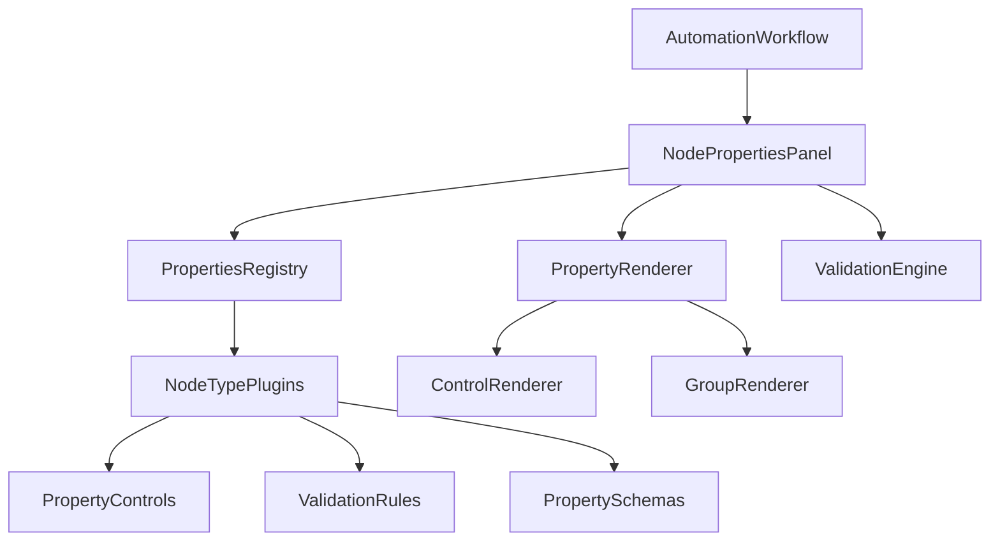
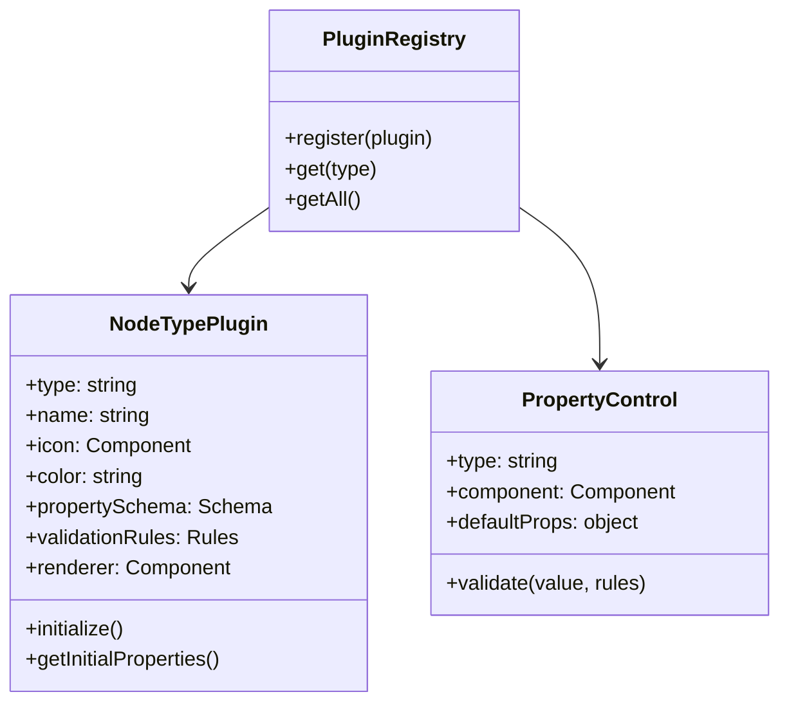
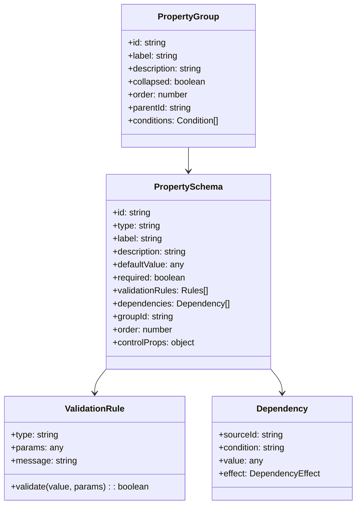

# Dynamic Properties Panel Architecture

This document outlines a comprehensive architecture for implementing a dynamic properties panel that is context-based and depends on the type of node. The architecture is designed to be fully featured with complex controls, integrated validation, nested property groups, and support for third-party plugins.

## 1. High-Level Architecture



## 2. Core Components

### 2.1 Plugin Architecture



### 2.2 Schema-Driven Property Definition



## 3. Key Benefits

1. **Separation of Concerns**: Each component has a specific responsibility, making the code more maintainable.
2. **Extensibility**: The plugin system allows adding new node types without modifying existing code.
3. **Flexibility**: Schema-driven approach allows for dynamic UI generation based on node types.
4. **Validation**: Integrated validation ensures data integrity.
5. **Reusability**: Components and controls can be reused across different node types.
6. **Third-Party Support**: Plugin system enables third-party developers to extend functionality.

## 4. Implementation Details

### 4.1 Plugin Registry

The plugin registry is a central repository that manages node type plugins, property controls, and validators. It provides methods to register and retrieve these components.

```javascript
// plugins/registry.js
class PluginRegistry {
  constructor() {
    this.nodeTypes = {};
    this.propertyControls = {};
    this.validators = {};
  }
  
  registerNodeType(plugin) {
    if (this.nodeTypes[plugin.type]) {
      console.warn(`Node type '${plugin.type}' is already registered. Overriding.`);
    }
    this.nodeTypes[plugin.type] = plugin;
    return this;
  }
  
  registerPropertyControl(control) {
    if (this.propertyControls[control.type]) {
      console.warn(`Property control '${control.type}' is already registered. Overriding.`);
    }
    this.propertyControls[control.type] = control;
    return this;
  }
  
  registerValidator(validator) {
    if (this.validators[validator.type]) {
      console.warn(`Validator '${validator.type}' is already registered. Overriding.`);
    }
    this.validators[validator.type] = validator;
    return this;
  }
  
  getNodeType(type) {
    return this.nodeTypes[type] || null;
  }
  
  getPropertyControl(type) {
    return this.propertyControls[type] || null;
  }
  
  getValidator(type) {
    return this.validators[type] || null;
  }
  
  getAllNodeTypes() {
    return Object.values(this.nodeTypes);
  }
}

export const pluginRegistry = new PluginRegistry();
```

### 4.2 Node Type Plugin

The `NodeTypePlugin` class defines the structure of a node type plugin. It includes information about the node type, its properties schema, validation rules, and initialization logic.

```javascript
// plugins/NodeTypePlugin.js
export class NodeTypePlugin {
  constructor(config) {
    this.type = config.type;
    this.name = config.name;
    this.icon = config.icon;
    this.color = config.color;
    this.description = config.description;
    this.propertySchema = config.propertySchema || [];
    this.propertyGroups = config.propertyGroups || [];
    this.validationRules = config.validationRules || {};
    this.renderer = config.renderer;
    this.initialProperties = config.initialProperties || {};
    this.initialize = config.initialize || (() => {});
  }
  
  getPropertySchema() {
    return this.propertySchema;
  }
  
  getPropertyGroups() {
    return this.propertyGroups;
  }
  
  getInitialProperties() {
    return typeof this.initialProperties === 'function' 
      ? this.initialProperties() 
      : { ...this.initialProperties };
  }
  
  getValidationRules() {
    return this.validationRules;
  }
}
```

### 4.3 Property Controls

Property controls are reusable UI components that render different types of inputs based on the property type. Each control handles its own validation and rendering.

```javascript
// controls/PropertyControl.js
export class PropertyControl {
  constructor(config) {
    this.type = config.type;
    this.component = config.component;
    this.defaultProps = config.defaultProps || {};
    this.validate = config.validate || (() => true);
  }
}

// Example control: TextInput
export const TextInputControl = new PropertyControl({
  type: 'text',
  component: ({ value, onChange, label, error, ...props }) => (
    <div className="mb-4">
      <label className="block text-sm font-medium text-gray-700 mb-1">{label}</label>
      <input
        type="text"
        value={value || ''}
        className={`w-full p-2 border ${error ? 'border-red-500' : 'border-gray-300'} rounded-md`}
        onChange={(e) => onChange(e.target.value)}
        {...props}
      />
      {error && <p className="mt-1 text-sm text-red-500">{error}</p>}
    </div>
  ),
  validate: (value, rules) => {
    if (rules.required && (!value || value.trim() === '')) {
      return 'This field is required';
    }
    if (rules.minLength && value.length < rules.minLength) {
      return `Must be at least ${rules.minLength} characters`;
    }
    if (rules.maxLength && value.length > rules.maxLength) {
      return `Must be no more than ${rules.maxLength} characters`;
    }
    if (rules.pattern && !new RegExp(rules.pattern).test(value)) {
      return rules.patternMessage || 'Invalid format';
    }
    return null;
  }
});

// More controls would be implemented for different input types
```

### 4.4 Property Renderer

The property renderer is responsible for rendering the properties UI based on the schema, groups, and controls.

```javascript
// renderer/PropertyRenderer.js
export const PropertyRenderer = ({ 
  node, 
  schema, 
  groups, 
  registry, 
  onChange,
  onValidate
}) => {
  const [errors, setErrors] = useState({});
  const [expandedGroups, setExpandedGroups] = useState({});
  
  // Initialize expanded groups
  useEffect(() => {
    const expanded = {};
    groups.forEach(group => {
      expanded[group.id] = !group.collapsed;
    });
    setExpandedGroups(expanded);
  }, [groups]);
  
  // Validate properties
  useEffect(() => {
    const validationEngine = new ValidationEngine(registry);
    const validationErrors = validationEngine.validateNodeProperties(node.type, node);
    setErrors(validationErrors);
    if (onValidate) {
      onValidate(Object.keys(validationErrors).length === 0, validationErrors);
    }
  }, [node, registry, onValidate]);
  
  const toggleGroup = (groupId) => {
    setExpandedGroups(prev => ({
      ...prev,
      [groupId]: !prev[groupId]
    }));
  };
  
  // Render property groups
  const renderGroups = () => {
    // Sort groups by order
    const sortedGroups = [...groups].sort((a, b) => (a.order || 0) - (b.order || 0));
    
    return sortedGroups.map(group => {
      // Check if group should be visible based on conditions
      const isVisible = evaluateGroupConditions(group, node);
      if (!isVisible) return null;
      
      // Get properties for this group
      const groupProperties = schema.filter(prop => prop.groupId === group.id);
      
      return (
        <div key={group.id} className="mb-6 border border-gray-200 rounded-lg overflow-hidden">
          <div 
            className="flex justify-between items-center p-3 bg-gray-50 cursor-pointer"
            onClick={() => toggleGroup(group.id)}
          >
            <h3 className="font-medium text-gray-900">{group.label}</h3>
            <ChevronRight 
              className={`w-4 h-4 transition-transform duration-200 ${expandedGroups[group.id] ? 'transform rotate-90' : ''}`} 
            />
          </div>
          
          {expandedGroups[group.id] && (
            <div className="p-3">
              {group.description && (
                <p className="text-sm text-gray-500 mb-3">{group.description}</p>
              )}
              
              {renderProperties(groupProperties)}
            </div>
          )}
        </div>
      );
    });
  };
  
  // Render individual properties
  const renderProperties = (properties) => {
    // Sort properties by order
    const sortedProps = [...properties].sort((a, b) => (a.order || 0) - (b.order || 0));
    
    return sortedProps.map(prop => {
      // Check if property should be visible based on dependencies
      const isVisible = evaluatePropertyDependencies(prop, node);
      if (!isVisible) return null;
      
      // Get the appropriate control component
      const control = registry.getPropertyControl(prop.type);
      if (!control) return null;
      
      const ControlComponent = control.component;
      const value = node[prop.id];
      const error = errors[prop.id];
      
      // Render the control
      return (
        <ControlComponent
          key={prop.id}
          label={prop.label}
          value={value}
          onChange={(newValue) => onChange(prop.id, newValue)}
          error={error}
          {...prop.controlProps}
        />
      );
    });
  };
  
  // Function to evaluate if a property should be visible based on its dependencies
  const evaluatePropertyDependencies = (prop, nodeData) => {
    if (!prop.dependencies || prop.dependencies.length === 0) return true;
    
    return prop.dependencies.every(dep => {
      const sourceValue = nodeData[dep.sourceId];
      
      switch (dep.condition) {
        case 'equals':
          return sourceValue === dep.value;
        case 'notEquals':
          return sourceValue !== dep.value;
        case 'contains':
          return Array.isArray(sourceValue) && sourceValue.includes(dep.value);
        case 'notEmpty':
          return sourceValue !== undefined && sourceValue !== null && sourceValue !== '';
        default:
          return true;
      }
    });
  };
  
  // Function to evaluate if a group should be visible based on its conditions
  const evaluateGroupConditions = (group, nodeData) => {
    if (!group.conditions || group.conditions.length === 0) return true;
    
    return group.conditions.every(condition => {
      const value = nodeData[condition.propertyId];
      
      switch (condition.operator) {
        case 'equals':
          return value === condition.value;
        case 'notEquals':
          return value !== condition.value;
        case 'contains':
          return Array.isArray(value) && value.includes(condition.value);
        case 'notEmpty':
          return value !== undefined && value !== null && value !== '';
        default:
          return true;
      }
    });
  };
  
  return (
    <div className="properties-renderer">
      {renderGroups()}
    </div>
  );
};
```

### 4.5 Node Properties Panel

The main panel component that uses the renderer to display properties for the selected node.

```javascript
// components/NodePropertiesPanel.jsx
const NodePropertiesPanel = React.memo(({
  node,
  onClose,
  onUpdate
}) => {
  if (!node) return null;
  
  const plugin = pluginRegistry.getNodeType(node.type);
  if (!plugin) return null;
  
  const propertySchema = plugin.getPropertySchema();
  const propertyGroups = plugin.getPropertyGroups();
  
  const handlePropertyChange = useCallback((propertyId, value) => {
    onUpdate(node.id, propertyId, value);
  }, [node.id, onUpdate]);
  
  const handleValidation = useCallback((isValid, errors) => {
    // You can handle validation results here
    // For example, disable save button if !isValid
  }, []);
  
  return (
    <div className="w-80 border-l bg-white overflow-y-auto animate-slideIn">
      <div className="p-4">
        <div className="flex justify-between items-center mb-4">
          <h2 className="text-lg font-medium text-gray-900">
            <span className={`inline-block w-3 h-3 rounded-full bg-${plugin.color}-500 mr-2`}></span>
            {plugin.name} Properties
          </h2>
          <button
            onClick={onClose}
            className="text-gray-500 hover:text-gray-700"
          >
            ×
          </button>
        </div>
        
        <PropertyRenderer
          node={node}
          schema={propertySchema}
          groups={propertyGroups}
          registry={pluginRegistry}
          onChange={handlePropertyChange}
          onValidate={handleValidation}
        />
      </div>
    </div>
  );
});
```

## 5. Example Node Type Implementation: Trigger Node

```javascript
// plugins/TriggerNodePlugin.js
import { NodeTypePlugin } from './NodeTypePlugin';
import { Zap } from 'lucide-react';

export const TriggerNodePlugin = new NodeTypePlugin({
  type: 'trigger',
  name: 'Trigger',
  icon: Zap,
  color: 'blue',
  description: 'Starts the workflow',
  
  propertyGroups: [
    {
      id: 'basic',
      label: 'Basic Information',
      description: 'Configure the basic trigger information',
      collapsed: false,
      order: 0
    },
    {
      id: 'triggerConfig',
      label: 'Trigger Configuration',
      description: 'Configure how this trigger works',
      collapsed: false,
      order: 1
    },
    {
      id: 'advanced',
      label: 'Advanced Settings',
      description: 'Configure advanced trigger options',
      collapsed: true,
      order: 2,
      conditions: [
        { propertyId: 'triggerType', operator: 'notEquals', value: 'simple' }
      ]
    }
  ],
  
  propertySchema: [
    {
      id: 'title',
      type: 'text',
      label: 'Title',
      description: 'The name of this trigger node',
      defaultValue: 'New Trigger',
      required: true,
      groupId: 'basic',
      order: 0
    },
    {
      id: 'subtitle',
      type: 'text',
      label: 'Subtitle',
      description: 'A brief description',
      defaultValue: '',
      required: false,
      groupId: 'basic',
      order: 1
    },
    {
      id: 'triggerType',
      type: 'select',
      label: 'Trigger Type',
      description: 'What type of trigger is this',
      defaultValue: 'segment',
      required: true,
      groupId: 'triggerConfig',
      order: 0,
      controlProps: {
        options: [
          { value: 'segment', label: 'Segment Membership' },
          { value: 'event', label: 'Event Occurred' },
          { value: 'schedule', label: 'Time Schedule' },
          { value: 'api', label: 'API Call' },
          { value: 'simple', label: 'Simple Trigger' }
        ]
      }
    },
    {
      id: 'segmentId',
      type: 'select',
      label: 'Segment',
      description: 'Which user segment triggers this flow',
      defaultValue: '',
      required: true,
      groupId: 'triggerConfig',
      order: 1,
      dependencies: [
        { sourceId: 'triggerType', condition: 'equals', value: 'segment' }
      ],
      controlProps: {
        options: [
          { value: 'new_users', label: 'New Users' },
          { value: 'power_users', label: 'Power Users' },
          { value: 'inactive', label: 'Inactive Users' }
        ]
      }
    },
    // More properties would be defined here
  ],
  
  validationRules: {
    title: {
      required: true,
      minLength: 3,
      maxLength: 50
    },
    // More validation rules would be defined here
  },
  
  initialProperties: {
    triggerType: 'segment',
    title: 'New Trigger',
    subtitle: ''
  }
});
```

## 6. Integration with Main Component

```javascript
// Inside AutomationWorkflow.jsx

// Import the plugin registry and plugins
import { pluginRegistry } from './plugins/registry';
import { TriggerNodePlugin } from './plugins/TriggerNodePlugin';
import { ControlNodePlugin } from './plugins/ControlNodePlugin';
import { ActionNodePlugin } from './plugins/ActionNodePlugin';

// Register built-in controls
import { TextInputControl, SelectControl, NumberControl } from './controls';

// Register node types
pluginRegistry.registerNodeType(TriggerNodePlugin);
pluginRegistry.registerNodeType(ControlNodePlugin);
pluginRegistry.registerNodeType(ActionNodePlugin);

// Register property controls
pluginRegistry.registerPropertyControl(TextInputControl);
pluginRegistry.registerPropertyControl(SelectControl);
pluginRegistry.registerPropertyControl(NumberControl);

// Generic node update handler 
const handleUpdateNodeProperty = (nodeId, propertyId, value) => {
  setWorkflowSteps(prevSteps => {
    const nodeIndex = prevSteps.findIndex(step => step.id === nodeId);
    if (nodeIndex === -1) return prevSteps;
    
    // Only create a new array if we're actually changing something
    if (prevSteps[nodeIndex][propertyId] === value) return prevSteps;
    
    const newSteps = [...prevSteps];
    newSteps[nodeIndex] = {
      ...newSteps[nodeIndex],
      [propertyId]: value
    };
    return newSteps;
  });
};

// Then in the render function:
{selectedNodeIndex !== null && (
  <NodePropertiesPanel
    node={workflowSteps[selectedNodeIndex]}
    onClose={() => setSelectedNodeIndex(null)}
    onUpdate={handleUpdateNodeProperty}
  />
)}
```

## 7. Third-Party Plugin Support

To support third-party plugins, create a plugin loader:

```javascript
// plugins/pluginLoader.js
export const loadExternalPlugin = async (url) => {
  try {
    // Dynamically import the plugin module
    const module = await import(/* webpackIgnore: true */ url);
    
    if (!module.default) {
      throw new Error('Plugin must export a default export');
    }
    
    // Validate plugin structure
    const plugin = module.default;
    if (!plugin.type || !plugin.name) {
      throw new Error('Plugin must have type and name properties');
    }
    
    // Register the plugin
    pluginRegistry.registerNodeType(plugin);
    
    return {
      success: true,
      plugin
    };
  } catch (error) {
    console.error('Failed to load plugin:', error);
    return {
      success: false,
      error: error.message
    };
  }
};
```

## 8. Advanced Custom Controls

Create advanced custom controls for complex property types:

```javascript
// Example: Condition Builder Control
export const ConditionBuilderControl = new PropertyControl({
  type: 'conditionBuilder',
  component: ({ value = [], onChange, label, error }) => {
    const [conditions, setConditions] = useState(value);
    
    const addCondition = () => {
      setConditions([...conditions, { field: '', operator: 'equals', value: '' }]);
    };
    
    const updateCondition = (index, field, newValue) => {
      const newConditions = [...conditions];
      newConditions[index] = { ...newConditions[index], [field]: newValue };
      setConditions(newConditions);
      onChange(newConditions);
    };
    
    const removeCondition = (index) => {
      const newConditions = conditions.filter((_, i) => i !== index);
      setConditions(newConditions);
      onChange(newConditions);
    };
    
    return (
      <div className="mb-4">
        <label className="block text-sm font-medium text-gray-700 mb-1">{label}</label>
        
        {conditions.map((condition, index) => (
          <div key={index} className="flex items-center space-x-2 mb-2">
            <input
              type="text"
              placeholder="Field"
              value={condition.field}
              onChange={(e) => updateCondition(index, 'field', e.target.value)}
              className="flex-1 p-2 border border-gray-300 rounded-md"
            />
            
            <select
              value={condition.operator}
              onChange={(e) => updateCondition(index, 'operator', e.target.value)}
              className="p-2 border border-gray-300 rounded-md"
            >
              <option value="equals">Equals</option>
              <option value="notEquals">Not Equals</option>
              <option value="contains">Contains</option>
              <option value="greaterThan">Greater Than</option>
              <option value="lessThan">Less Than</option>
            </select>
            
            <input
              type="text"
              placeholder="Value"
              value={condition.value}
              onChange={(e) => updateCondition(index, 'value', e.target.value)}
              className="flex-1 p-2 border border-gray-300 rounded-md"
            />
            
            <button
              type="button"
              onClick={() => removeCondition(index)}
              className="p-1 text-red-500 hover:bg-red-50 rounded"
            >
              ×
            </button>
          </div>
        ))}
        
        <button
          type="button"
          onClick={addCondition}
          className="mt-2 flex items-center text-sm text-blue-500 hover:text-blue-700"
        >
          <Plus className="w-4 h-4 mr-1" /> Add Condition
        </button>
        
        {error && <p className="mt-1 text-sm text-red-500">{error}</p>}
      </div>
    );
  }
});
```

## 9. Implementation Phasing

This architecture should be implemented in phases:

### Phase 1: Core Framework
1. Set up the plugin registry
2. Implement basic property controls
3. Create the base property renderer

### Phase 2: Node Type Plugins
1. Implement the trigger node plugin
2. Implement the control node plugin
3. Implement the action node plugin

### Phase 3: Advanced Features
1. Add validation system
2. Implement complex controls
3. Add property dependencies and conditional rendering

### Phase 4: Third-Party Support
1. Create plugin loader
2. Document plugin API
3. Create example third-party plugins

## 10. Conclusion

This architecture provides a robust, extensible framework for implementing a dynamic properties panel that is context-based and depends on the type of node. The component-based approach with a plugin system allows for easy maintenance and extension, while the schema-driven property definition enables complex UI generation with validation and conditional rendering.

The separation of concerns between the registry, plugins, controls, and renderers makes the system more maintainable and easier to test. The ability to support third-party plugins allows for future extensibility and community contributions.