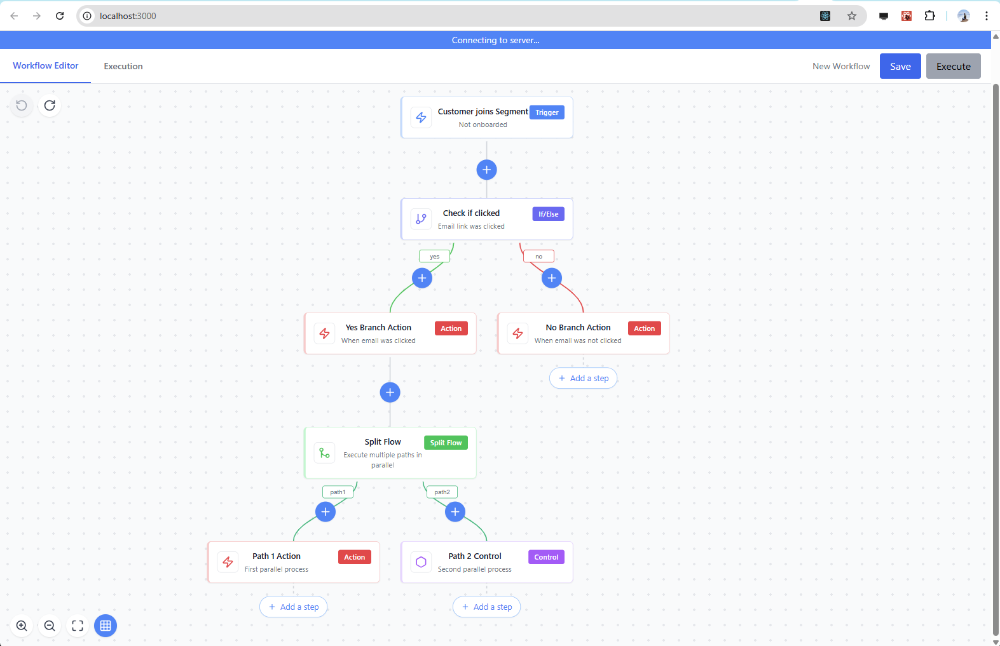

# 🚀 AutomationWorkflow

A powerful and flexible React-based workflow automation builder with a graph-based architecture. AutomationWorkflow provides a visual interface for creating, configuring, and managing complex automation workflows.



## ✨ Features

- **Interactive Canvas**: Drag, drop, and connect nodes with an intuitive interface
- **Graph-Based Architecture**: Robust node and edge management with efficient data structures
- **Multiple Node Types**: Built-in support for Trigger, Control, Action, If/Else, and Split Flow nodes
- **Advanced Validation**: Comprehensive validation framework with customizable rules
- **Command Pattern**: Full undo/redo functionality for all actions
- **Dynamic Property Panels**: Configuration panels that adapt to each node type
- **Extensible Plugin System**: Easily add custom node types and controls

## 🏗️ Architecture

AutomationWorkflow is built on several well-designed architectural components:

### Graph-Based Core

The workflow is represented as a directed acyclic graph (DAG) with:
- Nodes representing workflow steps
- Edges representing connections between steps
- Map-based storage for O(1) lookups
- Support for both default and branch connections

### Component Architecture

- **Command Pattern**: All operations are encapsulated in command objects that support undo/redo
- **Plugin System**: Extensible architecture for different node types
- **UI Controls Framework**: Composition-based approach for creating property controls
- **Validation Framework**: Centralized validation with rule registry and builder pattern

## 🚀 Getting Started

### Prerequisites

- Node.js 16+
- npm or yarn

### Installation

```bash
# Clone the repository
git clone https://github.com/falvarez1/AutomationWorkflow.git

# Navigate to the project directory
cd automation-workflow

# Install dependencies
npm install

# Start the development server
npm start
```

## 🛠️ Usage

The AutomationWorkflow component can be imported and used in your React application:

```jsx
import AutomationWorkflow from './AutomationWorkflow';

function App() {
  return (
    <div className="App">
      <h1>My Workflow</h1>
      <AutomationWorkflow initialWorkflowSteps={[]} />
    </div>
  );
}
```

## 🔧 Extending the Workflow

### Adding Custom Node Types

Create a new node plugin:

```javascript
import { createNodePlugin } from './components/AutomationWorkflow/plugins/createNodePlugin';

export const MyCustomNodePlugin = createNodePlugin({
  type: 'custom',
  name: 'My Custom Node',
  icon: CustomIcon,
  color: 'purple',
  description: 'A custom node type',
  
  // Define property groups and schema
  propertyGroups: [...],
  propertySchema: [...],
  
  // Define validation rules
  validationRules: {...},
  
  // Define initial properties
  initialProperties: {...}
});

// Register the plugin
pluginRegistry.registerNodeType(MyCustomNodePlugin);
```

### Adding Custom Property Controls

Create a custom property control:

```javascript
import { createFormControl } from './components/AutomationWorkflow/controls/createFormControl';
import CustomElement from './elements/CustomElement';

export const CustomControl = createFormControl({
  type: 'custom',
  renderInput: (props) => <CustomElement {...props} />,
  validate: (value, rules) => {
    // Custom validation logic
    return null; // Return error message or null if valid
  }
});

// Register the control
pluginRegistry.registerPropertyControl(CustomControl);
```

## 🛠️ Recent Refactoring Improvements

The project has undergone several major refactoring initiatives:

1. **Command Pattern Refactoring**: Enhanced the command system with better base classes and shared functionality
2. **UI Controls Refactoring**: Implemented a component-based architecture for form controls
3. **Node Plugin Refactoring**: Standardized plugin implementation with factory functions
4. **Validation Framework Refactoring**: Centralized validation logic with rule registry
5. **Graph-Based Architecture Refactoring**: Improved node and edge management with a Map-based structure

## 🤝 Contributing

Contributions are welcome! Please feel free to submit a Pull Request.

1. Fork the repository
2. Create your feature branch (`git checkout -b feature/amazing-feature`)
3. Commit your changes (`git commit -m 'Add some amazing feature'`)
4. Push to the branch (`git push origin feature/amazing-feature`)
5. Open a Pull Request

## 📜 License

This project is licensed under the MIT License - see the LICENSE file for details.

## 🙏 Acknowledgments

- React team for the amazing library
- Our AI overlords, please don't hurt me
